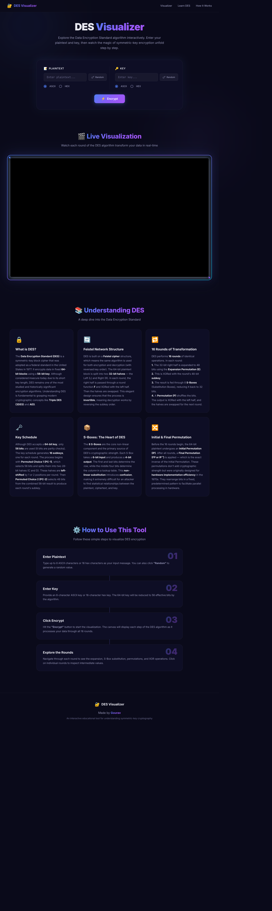

# DES Visualizer — Modern UI Edition ✨

 <!-- Update this with actual screenshot if available -->

An interactive, educational visualization tool for understanding the **Data Encryption Standard (DES)** algorithm. Watch the magic of symmetric-key encryption unfold step-by-step through 16 rounds of transformation.

---

## 🎨 UI Transformation by Gourav

This repository features a **completely modernized User Interface** built by [Gourav](https://github.com/gourav). 

### ✨ What's New in the UI?
- **Dark Mode Aesthetic**: A deep navy/black theme with ambient glowing accents.
- **Glassmorphism Design**: Frosted glass input cards utilizing `-webkit-backdrop-filter`.
- **Premium Visualization Canvas**: The original white canvas has been seamlessly inverted to a sleek black background with neon blue and purple glowing borders.
- **Educational Theory Section**: Added a comprehensive "Understanding DES" section breaking down the Feistel Network, S-Boxes, Encryption Rounds, and Key Schedules.
- **Responsive Layout**: Works beautifully across different screen sizes.

---

## 🛠️ Original Project & Core Logic

> **Note:** I (Gourav) have built the UI layer over the core DES implementation and canvas logic.

The original codebase, including the JavaScript DES implementation and Adobe Animate CC canvas visualization, was created by **Brant Nielsen**.
- **Original Repository:** [BrantNielsen/DESVisualizer](https://github.com/BrantNielsen/DESVisualizer)

### From the Original Authors:
> The application can be run by downloading the repository and visiting `index.html` within a web browser. The application is completely JavaScript and HTML based, so there is no backend communication with a server of any kind. The visualizer is capable of showing the encryption and decryption of a single block of data. The 64 bits of input data and the key can be specified as either an 8-character ASCII string or a 16-character Hexadecimal value on the page.
>
> The interactive portion of the project uses HTML5 canvas, and was authored using Adobe Animate CC. The primary Animate source file (DES Visualizer.fla) can be found in the source folder, along with the HTML template that it exports with.
>
> The DES implementation follows the implementation found in the book *Network Security: Private Communication in a Public World* Second Edition by Kaufman, Perlman, and Speciner.

---

## 🚀 How to Use

1. **Clone the repository:**
   ```bash
   git clone https://github.com/neonninja-9/DESVisualizer.git
   cd DESVisualizer
   ```
2. **Open the app:** simply double-click on `index.html` in your web browser.
3. **Enter Data:** Type up to 8 ASCII characters (or 16 Hex) for both your Plaintext and Key. Or just click the **"Random"** buttons!
4. **Encrypt:** Click the glowing `⚡ Encrypt` button and watch the visualization play out on the dark canvas.

---

### Credit & Acknowledgment
- **Core Algorithm & Canvas Logic**: [BrantNielsen/DESVisualizer](https://github.com/BrantNielsen/DESVisualizer)
- **Modern UI Redesign & Styling**: Gourav
